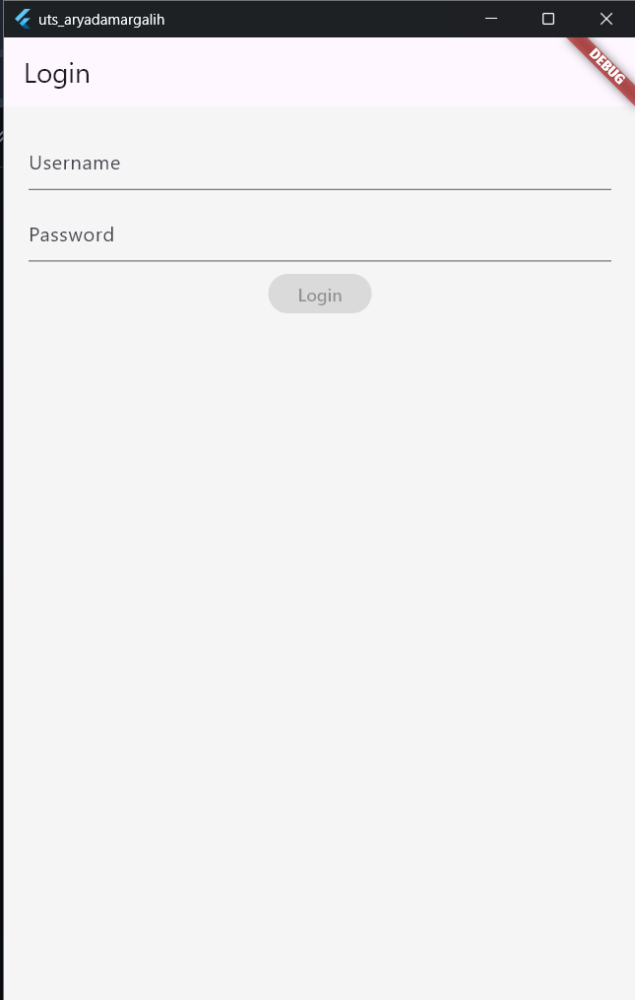
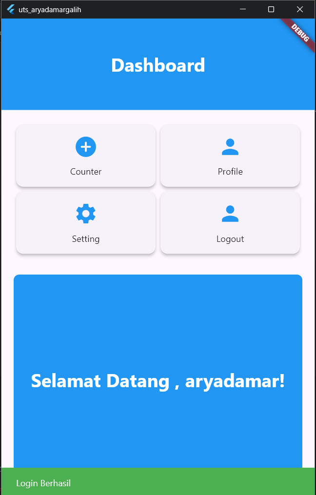
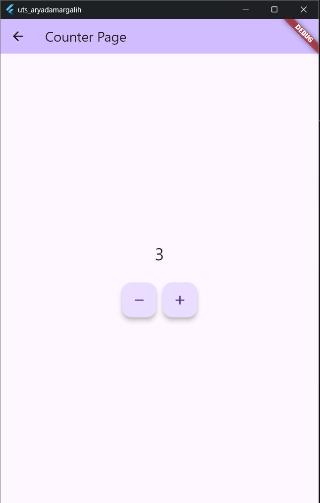
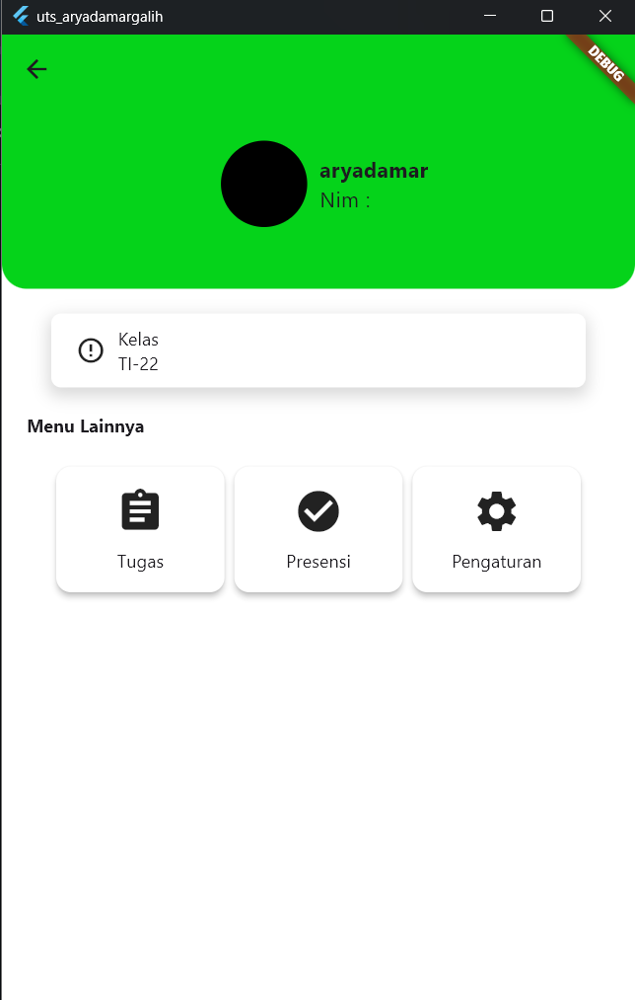

# uts_aryadamargalih

A new Flutter project.

## Getting Started

   
  <strong>Halaman Login</strong>

   
  <strong>Halaman Dashboard</strong>

   
  <strong>Halaman Counter</strong>

   
  <strong>Halaman Profile</strong>

